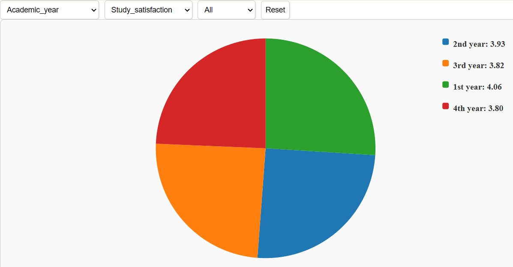

# Data Visualization Project

## Data

The data I propose to visualize for my project is [this dataset](https://www.kaggle.com/datasets/abdullahashfaqvirk/student-mental-health-survey), a mental health survey dataset which contains data from a multitude of different universities via a survey.

## Questions & Tasks

The following tasks and questions will drive the visualization and interaction decisions for this project:

 * I want to see the correlation with academic workload and
  social relationships
 * I want to see the correlation with academic pressure and
  depression
 * I want to see the correlation with academic year and
  future insecurity
 * I want to see the distribution of majors to academic
  pressure
 * I want to see the correlation with university and academic
  pressure

## Sketches

(insert one or more hand-drawn sketches of interactive visualizations that you imagine)
(describe each sketch - how is the data visualized, what are the interactions, and how do these relate to the questions/tasks)
[

## Prototypes

I’ve created a proof of concept visualization of this data. It's a pie chart and it shows the general structure of how I want the pie chart to look for each of the academic years based on what metric the user wants to visualize

The Vizhub for this chart can be found [here](https://vizhub.com/JoeRozman/338ba401e2b2473a87139a0ccb65dc66?edit=files&file=README.md&tabs=index.js%7EREADME.md)

## Chart Revisions

Created basic legend

Added dropdown for attributes and metrics

Added dropdown for universities

Added option for all universities data, added hovering to pie slices

Added reset button, styling and polishing for user experience

## Open Questions

My biggest worry at the moment is time management, as I am working full time while creating this project and I want to put in the most effort I can as this is an important project to me. As for implementation worries, my biggest worry is implementing the selector for the multiple metrics, as well as having the visualization formatted for a nice user experience.

## Milestones

Week 1: Implement the Pie Chart with labeling (either a legend or labeling within the chart itself)

Week 2: ~~Implement the metric selector~~ Implement selectors for attributes and metrics

Week 3: ~~Implement the university selector~~ Decide if data should use all metrics or should use universities as metrics

Week 4: ~~Configure the visualization for the user experience~~ Incorporate university selector

Week 5: ~~Debug and work on finishing touches~~ Incorporated slice highlighting as well as option for all universites

Week 6: Debug and work on finishing touches

Week 7: Debug and work on finishing touches

### New Vizes
Initial Viz for week two [here](https://vizhub.com/JoeRozman/338ba401e2b2473a87139a0ccb65dc66)

Viz for week three [here](https://vizhub.com/JoeRozman/7bb7dfb4abe142fba5cac5334c3f0ed9?edit=files&file=index.js&tabs=index.js%7EchartStyles.css%7EMentalHealthSurvey.csv)

Viz for week four [here](https://vizhub.com/JoeRozman/0d687f77473e4ebd90b71c5a00cfedbd?edit=files&file=README.md)

Viz for week five [here](https://vizhub.com/JoeRozman/9856e206f5074053a5d729f79a782827)

Viz for week six [here](https://vizhub.com/JoeRozman/441ca0e851334323ac286ccae40223d8)
